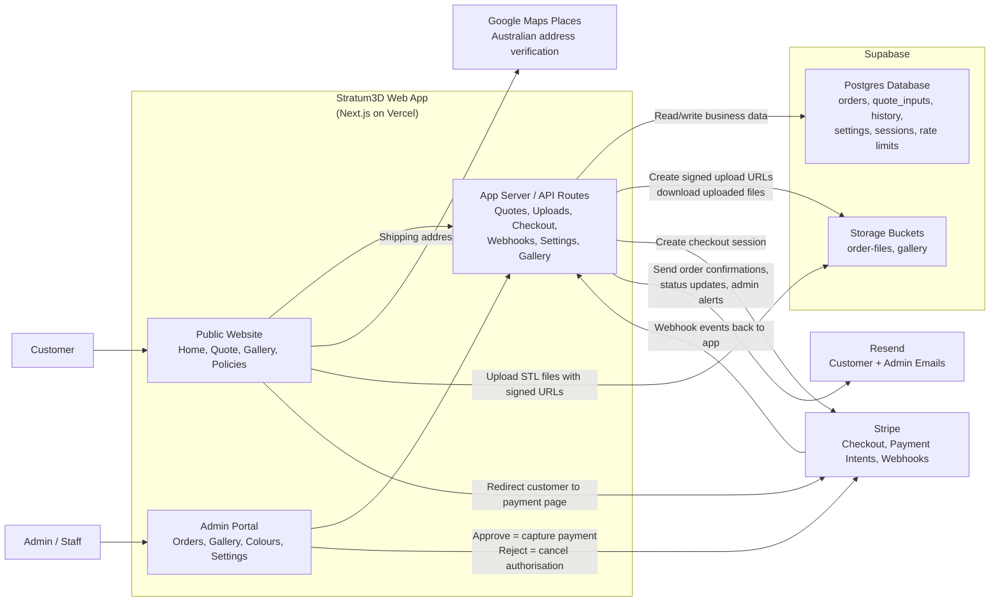

# Stratum3D High-Level Integration

This diagram shows how the main Stratum3D website, admin area, and required external services fit together.

## System Diagram

## Simple Flow

1. The customer uses the public website to upload STL files, configure print settings, and request a quote.
2. The app stores quote/order data in Supabase and uploads the STL files into Supabase Storage.
3. If the customer chooses shipping, the address is verified through Google Maps Places.
4. The app creates a Stripe Checkout session and sends the customer to Stripe to authorise payment.
5. Stripe sends webhook events back to the app after checkout.
6. The app updates the order in Supabase and sends email notifications through Resend.
7. The admin logs into the admin portal to review the order.
8. When the admin approves the order, the app captures the Stripe payment. If the admin rejects it, the app cancels the payment authorisation.
9. The admin portal continues updating order status, gallery content, colours, and settings through the same app and Supabase backend.

## Required Services In The Current Build

- `Vercel`: hosts the Next.js website and API routes.
- `Supabase`: database, storage, and admin session persistence.
- `Stripe`: checkout, payment authorisation, capture, cancellation, refunds, and webhooks.
- `Resend`: transactional customer/admin emails.
- `Google Maps Places`: shipping-address verification for Australian addresses.

